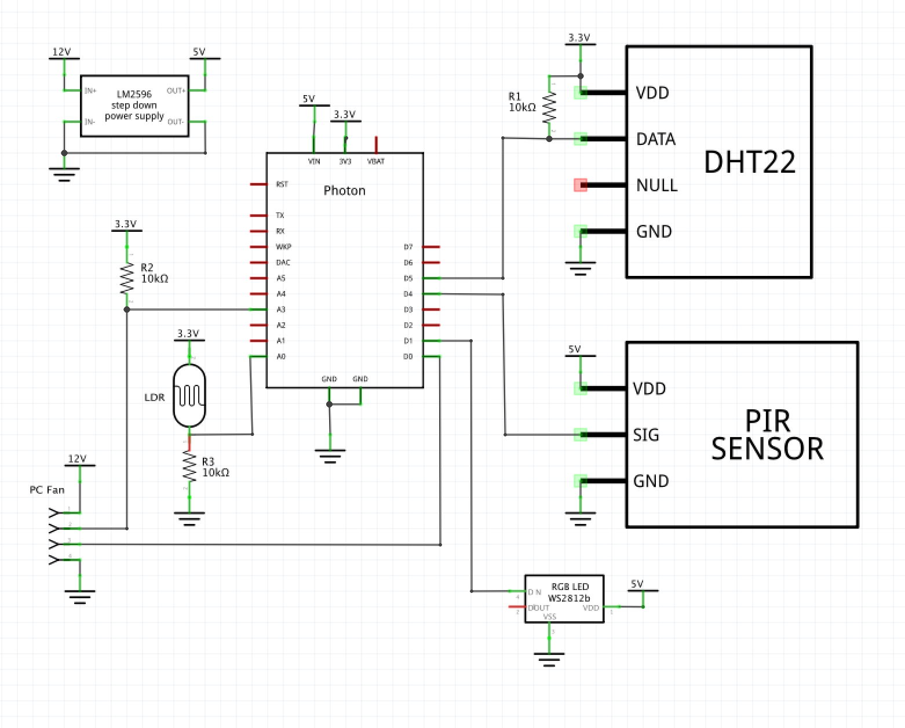

# Quiet Bathroom Fan
## Goal
My goal was to create a bathroom fan that would be very quiet and would be easy to clean. Removing the dust helps to keep the fan quiet.
The fan needed to be speed controlled, so the humidity could be removed quickly after a shower, and the rest of the time the air would not be renewed too fast (to avoid losing heat during winter, to be the quietest possible the rest of the time).
## Description
### Fan
This project started when I found out how quiet a good PC fan can be. So it was obvious for me to use a PC fan for that project. I chose 120mm fan, that size fits perfectly the hole in my bathroom wall.
A PC fan was also a perfect choice because most of the can be controlled with a PWM signal.

One of the concerns could be the humidity and the fan. I don’t think it will be a problem in the long term, since the goal of this project is to remove humidity. If the fan fails too quickly, I will change it for a model that can support more humidity (IP52 or even IP 67).

I went with a Noctua one as it has a good reputation, but other brands would work fine too. It is not clear which model is the best. Of course, the noise and the airflow speed are important parameters, but it seems that the static pressure should be important too (in case the wind tries to blow air in the opposite direction).
The NF-A12x25 PWM or NF-F12 PWM seem to be a good compromises.

One important part is that kind of PC fan uses 12V.

### Case
I went for the simplest way to get something that fits exactly the need: 3D printing. I used OpenSCAD software. I know how to use it and that is definitely a good solution for that kind of project.

### Microcontroller
There are a lot of possible choices. I prefered to have a wifi microcontroller, to get temperature and humidity monitoring. That’s definitely not a requirement. Any small arduino like should work fine.
The extra feature was to be able to upload a new firmware without a USB cable. I knew I would adjust a lot the software at the beginning. I wanted to avoid having a USB cable hanging, or worse, having to open and close the fan box too often.
I think the popular ESP32 could be a good choice. But, in the past, I used few Particle Photon, so I used it again for that project.

With most of choices, 5V is needed to power the microcontroller (even if it works in 3.3V for input/output).

### Voltage
The big issue of this project is the voltage. This project has to be connected to 230V. Be aware, this can be very dangerous, and a mistake can be deadly.
Since the fan needs 12V, I chose to get from 230V to 12V, and then convert the 12V into 5V for the microcontroller.

### Sensors
Of course a humidity sensor is needed. I choose a basic one : DHT22. Since it is always easier to add stuff during design than once the project is finished. I also added:
PIR sensor
light sensor
One of my ideas is to reduce a little the fan speed when nobody is inside the bathroom. My bathroom is next to my bedroom, so I might try to reduce to 80% the speed fan after I leave my bathroom, late at night.
All 3 sensors can work in 3.3V

### LEDs
I knew I would spend time to adjust my software according to the humidity and the fan noise. To avoid having to use my laptop/phone to get values about the fan speed and humidity, I chose to add 8 NeoPixels from Adafruit. The goal is to display those values and have a quick look, so I can understand what is going on.
And also because it looks cool :).

### Components
- 240V to 12V
https://www.amazon.fr/gp/product/B017R4INRI/
- 12V to 5V
https://www.amazon.fr/dp/B07B7KCT44/
- PC Fan
https://www.amazon.fr/gp/product/B00KESS6O0/
- Temperature and humidity sensor
https://www.amazon.fr/Homyl-Dhumidit%C3%A9-Temp%C3%A9rature-Num%C3%A9rique-Adaptateur/dp/B07C9DRHL5/
- Photon particle
https://www.amazon.fr/Particle-PHOTONNOH-Photon-without-Headers/dp/B01BKOVIY6
- PIR sensor
https://www.amazon.fr/COM-four-pyroelektrischer-infrarouge-détecteur-mouvement/dp/B00W7CHFWU
- LDR
https://www.amazon.fr/qualité-Lumière-résistance-dépendant-photorésistance/dp/B00NXW9WZ6
- NeoPixel
https://www.amazon.fr/NeoPixel-Stick-WS2812-Integrated-Drivers/dp/B00KLBTT1E
- Fan filter
https://www.amazon.fr/gp/product/B00DL4BMVS

## 3D Model
To be able to print correctly the fan case, the model has been divided into 3 pieces: 
- the tube for the exhaust fan
- the case itself
- the lid

The tube and the case have been glued with hot glue so it can be detached later if needed.
I wanted to screw the lid to the case, but it is not useful. I also wanted to use small magnets to keep the filter, but it is not needed either.
Both fit perfectly.

## Schema

Fan
- PWM connected to D0
- Rotation pin connected to A3 with a pull-up 10k resistor to 3.3V

LDR
- 3.3V
- Pulldown 10k to ground and pin A0

NeoPixel (8 RGB pixels)
- pin: D1

PIR
- pin: D4
DHT 22 (humidity & temperature)
- pin: D5
- Pullup 10k to 3.3V

## Software
